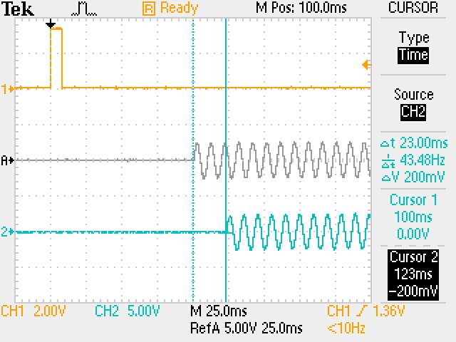
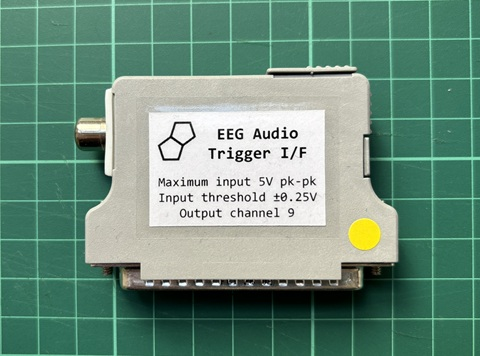
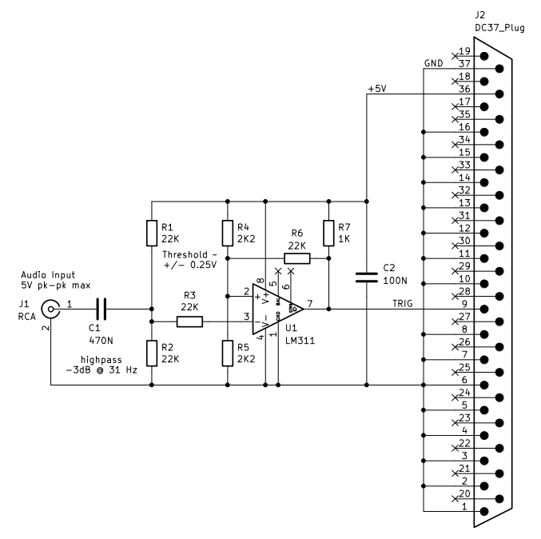
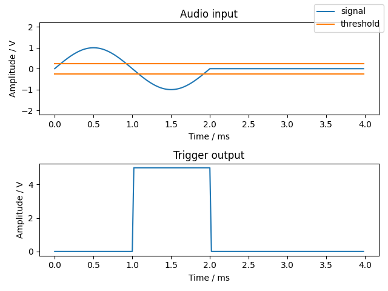
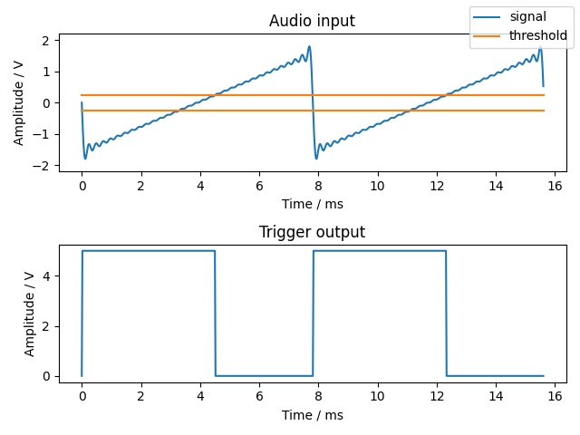
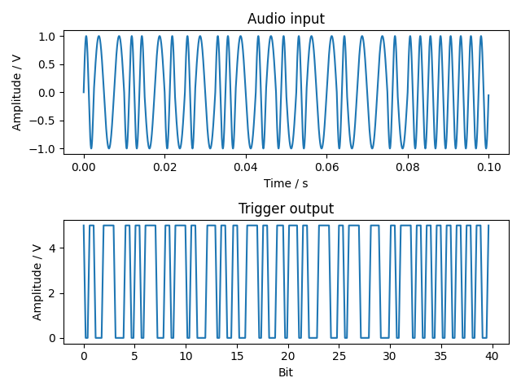

# EEG Audio Trigger Interface
*Gordon Mills – UCL Psychology and Language Sciences*

This document describes a hardware device for interfacing an audio signal to an EEG acquisition system for the purpose of capturing audio trigger data alongside EEG data. Whilst the device targets a [BioSemi](https://www.biosemi.com) EEG system, its principle of operation is applicable to systems from other vendors.

## Introduction
Trigger data are generally required in experimental EEG acquisition, to associate the EEG data with stimulus and/or response events. Typically, this function is performed by interfacing the computer that is delivering stimulus and/or capturing responses to the EEG acquisition system. For example, the [BioSemi Trigger Cable](https://www.biosemi.com/faq/USB%20Trigger%20interface%20cable.htm) connects a [BioSemi Receiver](https://www.biosemi.com/receiver.htm) to a computer via USB.


This enables the computer to send trigger signals to the Biosemi Receiver under the control of software. The following pseudo-code shows how a trigger may be sent to indicate the onset of audio stimuli.
```
send_trigger()
play_audio()
```
These two operations will not occur at the same time, the trigger will precede the audio onset. The interval between the two events is dependent on hardware performance, implementation language, audio device driver latency, and instantaneous operating system state. The first three of these factors contribute to a constant latency, and the last to a latency variation.



*Figure 1 – Trigger to audio latency variation measurement*

A typical case is shown in Figure 1. Trigger to audio onset latency was measured using a Biosemi Trigger Cable, RME Fireface, and a Windows PC running Matlab and Psychtoolbox. Latency was found to vary between a minimum of 100 ms and a maximum of 123 ms over 10 otherwise identical trials. These figures are typical and will be in the same order for any desktop OS hardware and software setup. Mean latency may be compensated for by measurement of and calibration to a specific setup. However, latency variation cannot be predicted for a given trial and remains a source of timing uncertainty. Whilst timing resolution in the order of 10 ms may be considered adequate for cortical EEG signals, which typically have bandwidth in the order of 10 Hz, when combining acquired data it is highly beneficial to minimise timing deviation. Furthermore, for auditory brainstem response signals, which typically have bandwidth in the order of 1 kHz, timing resolution of 10 ms order is of no utility.

## Approach
To eliminate the timing uncertainty associated with software methods, a hardware device has been developed which generates a trigger signal from an audio signal.



*Figure 2 – Audio trigger Interface*

The circuit is based around the LM311 high-speed voltage comparator. With reference to Figure 3, R1 with R2, and R4 with R5, bias the inverting and non-inverting inputs of U1 respectively to a nominal operating point of 2.5 V, to accommodate the bipolar audio input signal. C1 AC couples the audio input to the inverting input of U1, with R3 providing input protection. R6 provides feedback to the non-inverting input of U1 resulting in Schmitt trigger behaviour with thresholds of approximately ±2.5 V * 2k2 / 22k = ±0.25 V. Finally, since U1 has an open-collector output, R7 pulls up the trigger signal.



*Figure 3 – Schematic diagram*

The circuit consumes <10 mA @ 5 V and is powered from the auxiliary power pins of the BioSemi Receiver. The trigger signal is routed to trigger input 9 so that the device may coexist with a BioSemi trigger cable or legacy parallel port trigger cable, both of which occupy inputs 1-8. Note that all unused trigger inputs are tied to ground in the device, in order to support an unfortunate design decision by BioSemi. Systems with multiple trigger interfaces therefore require splitter, rather than simple bus, cabling.

## Usage
The device may be used in the following usage scenarios.

### Marker
Stereo or multi-channel audio is prepared containing a simple trigger signal in one of the channels and stimuli in the other(s). The stimulus is presented to the participant and the trigger signal directed to the trigger interface. The interface detects zero crossings in the signal and generates a trigger transition for each. The trigger event is thus precisely time-aligned with the stimulus signal. A rising trigger edge is generated for a negative audio zero crossing and a falling trigger edge for a positive audio zero crossing. Note that the Biosemi Receiver samples its trigger inputs at the EEG acquisition sampling rate. Trigger signals should be generated with this constraint in mind, that is pulses should have duration ≥ 1 / fs.



*Figure 4 – Simple marker trigger using sinusoid cycle*

### Audio Direct
Audio stimuli or responses may be routed directly to the trigger interface for generation of a correlated trigger sequence. This approach is particularly effective for periodic stimuli, such as that used to elicit auditory brainstem responses, since accurate timing may be trivially inferred from the trigger sequence. It is sometimes also possible to infer accurate timing for more complex signals, by cross-correlation.



*Figure 5 – Direct trigger using analytic sawtooth stimuli*

### Timecode
By using appropriate encoding and modulation, arbitrary serial data may also be transmitted through the interface. A protocol has been developed to allow both accurate timing and metadata to be embedded in stimuli or broadcast in an experimental setup. Details of software support for this use case can be found in [utileegy.md](utileegy.md).



*Figure 6 – Short Time Code word 1:23:45.6 + User Data word 42*
