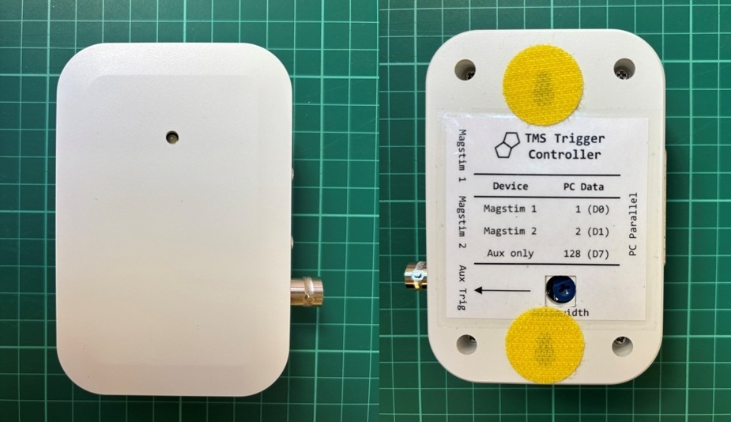
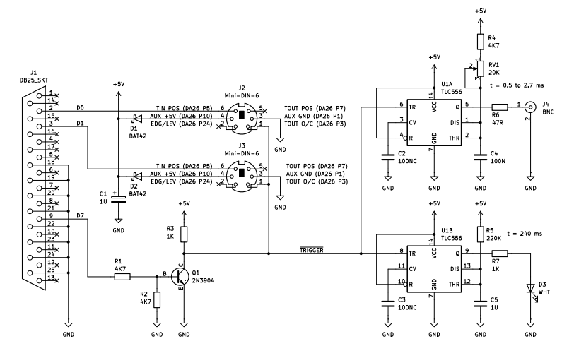
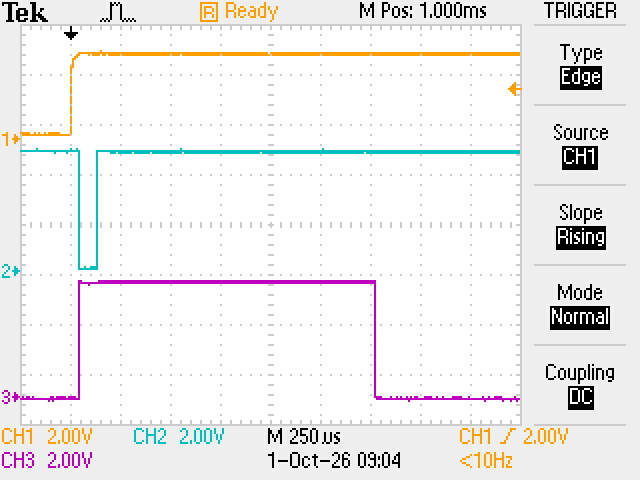

# TMS Trigger Controller
*Gordon Mills – UCL Psychology and Language Sciences*

This document describes a hardware device for combining and conditioning trigger signals within a Transcranial Magnetic Stimulation (TMS) experimental setup. The device enables integration of TMS stimulators with an experimental PC and additional equipment for neuronavigation and electromyography (EMG).

## Introduction
TMS experimental protocols may require manually or automatically invoked stimuli delivery, or a combination of the two. Furthermore, data acquisition equipment within an experimental setup need triggering at the onset of stimulus. This creates a requirement for combining and distributing trigger signals from and to equipment items from different manufacturers, with differing interfaces.

The device described in this document provides integration for the following equipment items:

* [Magstim BiStim²](https://www.magstim.com/product/magstim-bistim2/) - Edge or level TTL trigger I/O on DA-26 connector
* [Magstim Rapid²](https://www.magstim.com/product/rapid%C2%B2/) - Edge or level TTL trigger I/O on DA-26 connector
* Desktop PC with [Parallel Port](https://en.wikipedia.org/wiki/Parallel_port) - TTL trigger output on DB-25 connector
* Rogue Research Analog Interface - Edge TTL trigger input on BNC connector
* [CED Micro 1401](https://ced.co.uk/products/mic4in) - Edge TTL trigger input on BNC connector
* [Digitimer D440](https://www.digitimer.com/product/life-science-research/amplifiers/d440-2-or-4-channel-isolated-amplifier/) - Level TTL DEBLOCK input on BNC connector

## Approach
The Magstim stimulators provide a flexible trigger I/O interface, which could directly support bi-directional triggering and combination of trigger signals using a passive wiring arrangement. However, such an arrangement could only provide edge, not level, triggering to additional equipment items and would have limited cable drive capability. A device has been developed which exploits the flexibility of the stimulator trigger I/O and augments it with the capability to provide a controllable pulsewidth active trigger output suitable for connection to multiple devices, which require edge or level trigger signalling.

*Figure 1 – TMS trigger controller (front and rear views)*

With reference to Figure 2, power for the controller is derived from the AUX +5V power outputs (DA-26 pin 10) of the stimulators. D1 and D2 combine the supplies, so that either or both may be used, with C1 providing local storage and decoupling. Trigger inputs TIN POS (DA-26 pin 5) of each stimulator are wired directly to data lines D0 and D1 of the parallel port, so that writes of 1 or 2 will trigger one of the stimulators. The TOUT O/C trigger outputs (DA-26 pin 3) of the stimulators produce a low pulse of 100 μs duration whenever the unit is triggered, either by the front panel switch, foot switch, or via their trigger inputs. Due to their open-collector drive, the TOUT O/C signals may be directly combined. Q1 provides an additional open-collector trigger drive from data line D7 of the parallel port, so that a write of 128 will generate a local trigger. The resulting /TRIGGER signal is a combination of all the trigger sources. This is used to trigger monostables U1A and U1B, which produce active-high pulses of 0.5 ms - 2.7 ms and 240 ms duration respectively. The former is routed to the BNC output, with duration adjustable using RV1 accessible from the rear of the controller. The latter drives the LED, for brief indication of trigger events.

The neuronavigation and data acquisition systems are sensitive to the rising edge of the trigger signal and are thus unaffected by its duration. However, the EMG amplifier suppresses artefacts for the active duration of the trigger pulse. This should be kept as short as practical to avoid suppressing the physiological response signal.

*Figure 2 – Schematic diagram*

The design is based on the venerable 556 dual timer IC, since it provides exactly the functionality required without the need for software development or possible latency concerns associated with a microcontroller. But note that only the [TLC556](https://www.ti.com/product/TLC556) should be used here. The bipolar 556 has bad transient behaviour and the CMOS 7556 has insufficient output drive capability. Figure 3 shows the signal timing for a trigger event invoked by the experimental PC. It can be seen that there is no discernible delay between the trigger of the stimulator and the output of the device, which is stretched to a set pulsewidth of 1.5 ms.

*Figure 3 – Signal timing (1. PC parallel port D0, 2. Stimulator 1 TOUT O/C, 3. BNC trigger output)*

## Usage
The stimulators and PC connect to dedicated ports on the device and additional equipment items to the AUX (BNC) port using T-piece adaptors. The table below details the trigger actions peformed by the controller for given events.

| Event | Magstim 1 | Magstim 2 | Aux |
| --- | --- | --- | -- |
| PC write value 0 | - | - | -
| PC write value 1 | Trigger | - | Trigger
| PC write value 2 | - | Trigger | Trigger
| PC write value 128 | - | - | Trigger
| Magstim 1 manual | Trigger | - | Trigger
| Magstim 2 manual | - | Trigger | Trigger
